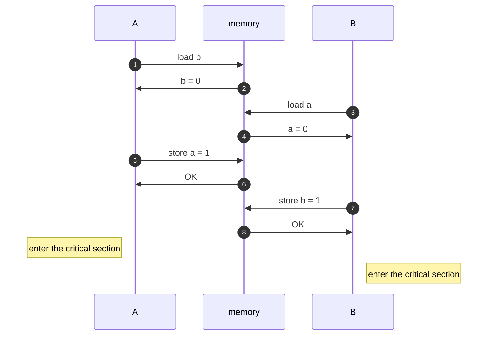

# Low-Level Safety

In this article, we take a bird's eye view over low-level shared-memory safety.

!!! note

    The information provided here is very abstract. If you're just looking to make
    your code safe, you should probably use something concrete instead.


## How to make a multiprocessor computer that correctly executes multithreaded programs

In case you ever wandered how to make such computers, the answer is quite
straightforward. There are two requirements:

> 1. each processor issues memory requests in the order specified by its program
> 2. memory requests from all processors issued to an individual memory module are
>    serviced from a single FIFO queue (issuing a memory request consists of entering
>    the request on this queue)

With these in mind, you should be convinced that the following pseudocode
implements a mutual exclusion algorithm for two threads (assume `a` and `b`
were initialized with 0):

=== "Thread A"

    ```
    a ← 1
    if (b = 0) {print "A"}
    ```

=== "Thread B"

    ```
    b ← 1
    if (a = 0) {print "B"}
    ```

It should be easy to see that either:

- A gets into the critical section (the print instruction),
- B does, or
- none of them do.

(In a realistic program you'd wish to make both A and B enter their critical
sections eventually, but let's simplify things here.)

Now, let's consider the same program written in C:

=== "Thread A"

    ```
    a = 1;
    if (b == 0) {printf("A\n");}
    ```

=== "Thread B"

    ```
    b = 1;
    if (a == 0) {printf("B\n")}
    ```

This code does not implement mutual exclusion. It is entirely possible to
observe this output:
```
B
A
```

The unfortunate reality is that both of the above requirements don't hold in
general:

1. there exist memory models (see below)
2. to enhance performance, a processor usually has a so-called _store-buffer_ in
   which several store instructions can be held before actually flushing them to
   the memory module

This second issue can be solved using memory barriers (also termed fences), or
atomic hardware instructions (see section Compare and Swap below).


## Memory Models

!!! note

    Python does not have a memory model (yet).

In a language like C, or Java, when you write a program you are in fact
producing two: one is written by you, and the other by your compiler.
Those two programs can in fact be very different from each other.

In the example above, the C code can produce an executable program in which the
load instruction in the second line is issued before the store instruction in
the first. Even if we assumed the absence of store-buffers, we may be surprised
to still see this behavior:



The compiler has modified the order of our memory operations in a way which has
broken the mutual exclusion property of our program.

If we were to correct the program and tell the compiler which instructions not
to reorder, we would do it like this (assuming our compiler has `stdatomic.h`):

=== "Thread A"

    ```
    atomic_store_explicit(&a, 1, memory_order_release);
    if (atomic_load_explicit(&b, memory_order_acquire) == 0) {printf("A\n");}
    ```

=== "Thread B"

    ```
    atomic_store_explicit(&b, 1, memory_order_release);
    if (atomic_load_explicit(&a, memory_order_acquire) == 0) {printf("B\n");}
    ```

For more details on the C memory model, please refer to
[cppreference.com](https://en.cppreference.com/w/cpp/atomic/memory_order).


## Compare and Set

To solve the issue of the store-buffer we may flood our code with memory
barriers, but there are more sophisticate instructions that we can use. They are
usually called atomic writes/stores/instructions. The most commonly used one is
called "compare and set" (also termed "compare and swap" or "compare exchange").

The cost of a memory barrier and that of an atomic instruction are roughly the
same on most architectures.

An atomic compare-and-set instruction is a hardware instruction that takes three
arguments: a pointer to a memory location, an expected value, and a desired
value. It commonly behaves like this:

- read the value contained at memory address M
- if the value is the expected one:
    - change stored value to the desired one
    - signal a success (usually setting a register)
- otherwise:
    - don't change the stored value
    - signal a failure.

This behavior is exactly what's needed to implement any correct concurrent
program. No more, no less. You can find a proof of this in [M. Herlihy,
"Wait-Free Synchronization"](https://dl.acm.org/doi/10.1145/114005.102808). You
can also find a proof as to why normal reads and writes are not enough to
implement concurrent programs (have a consensus number of 1).

If your compiler has support for `stdatomic.h`, this gets converted into your
architecture's compare-and-set instruction:

```c
atomic_compare_exchange_strong_explicit(
    addr,
    &expected, desired,
    memory_order_acq_rel, memory_order_acquire
);
```

!!! tip

      With cereggii, this functionality is exposed to Python code:
   
      ```python
      import cereggii
      ref = cereggii.AtomicRef(0)
      ref.compare_and_set(expected=0, desired=1)
      ```

### The Implementation of CAS — False Sharing

The implementation of CAS does not affect the correctness of a multithreaded
program, but it can greatly impact its performance.

See the [Performance](./performance.md) article for more information on this and on how to get more
performance from your shared-memory program.


### The ABA Problem

There is a common problem with compare-and-set instructions, known as the ABA
problem, that generally pertains lock-free algorithms.

Consider this situation:

1. thread $T_1$ reads memory location $M$, observing value $V$
2. another thread $T_2$ writes value $V'$ into $M$
3. $T_2$ writes $V$ into $M$
4. $T_1$ successfully CASes $M$ from $V$ to another value $V''$

Was it ok for $T_1$ to have had a success? Maybe not.

See [Wikipedia's article](https://en.wikipedia.org/wiki/ABA_problem) for more information.


### Load-Linked Store-Conditional

Some architectures, notably ARM, implement the compare-and-set instruction
described above, with a variant known as Load-Linked/Store-Conditional (LL/SC).

Instead of implementing CAS with a single indivisible instruction, these
architectures use two instructions. With the first, some cache line is read by
one processor and is generally marked as exclusive in cooperation with the
cache-coherency protocol. When doing so, the core knows that:

1. it has the most recent value for that line, and
2. no other processor has the same line marked as exclusive in its own cache.

Later, the store is performed so that it only succeeds in its write if the line
is still marked as exclusive. (There are restrictions on how much later this is
done, for instance requiring that the load is immediately followed by the
store.)

It follows that the ABA problem cannot arise: when one core succeeds in its
store, it knows that no other core wrote into the same location.

The downside is that the CAS operation may fail spuriously when other cores are
writing into the same line, even at different locations.
