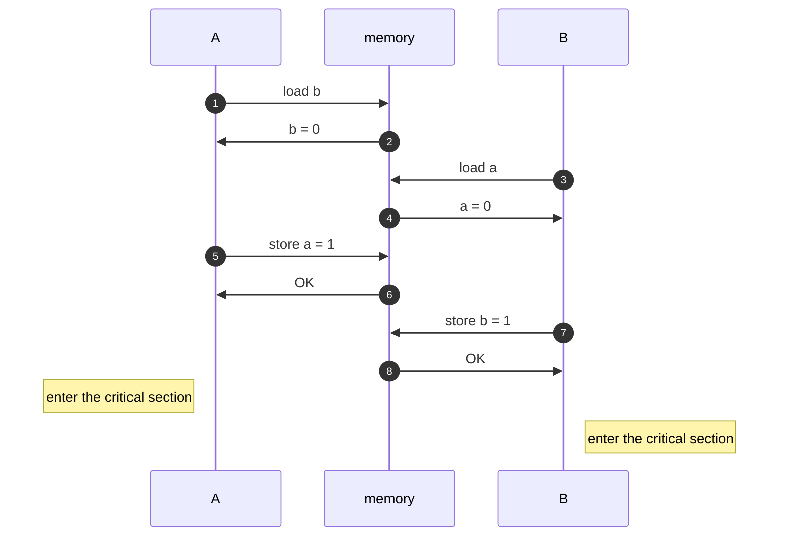

# Low-Level Safety


## How to make a multiprocessor computer that correctly executes multithreaded programs

(The title is a reference to a paper by L. Lamport.)

In case you ever wandered how to make such computers, the answer is quite
straightforward. There are two requirements:

1. each processor issues memory requests in the order specified by its program
2. memory requests from all processors issued to an individual memory module are
   serviced from a single FIFO queue (issuing a memory request consists of entering
   the request on this queue)

With these in mind, you should be convinced that the following pseudocode
implements a mutual exclusion algorithm for two threads (assume `a` and `b`
were initialized with 0):

=== "Thread A"

    ```
    a ← 1
    if (b = 0) {print "A"}
    ```

=== "Thread B"

    ```
    b ← 1
    if (a = 0) {print "B"}
    ```

It should be easy to see that either A gets into the critical section (the print
instruction), B does, or none of them do. (In a realistic program you'd wish to
make both A and B enter their critical sections eventually, but let's simplify
things here.)

Now, let's consider the same program written in C:

=== "Thread A"

    ```
    a = 1;
    if (b == 0) {printf("A\n");}
    ```

=== "Thread B"

    ```
    b = 1;
    if (a == 0) {printf("B\n")}
    ```

This code does not implement mutual exclusion. It is entirely possible to
observe this output:
```
B
A
```

The unfortunate reality is that both of the above requirements don't hold in
general:

1. there exist memory models (see below)
2. to enhance performance, a processor usually has a so-called _store-buffer_ in
   which several store instructions can be held before actually flushing them to
   the memory module

This second issue can be solved using memory barriers (also termed fences), or
atomic hardware instructions (see section Compare and Swap below).


## Memory Models

!!! note

    Python does not have a memory model (yet).

In a language like C, or Java, when you write a program you are in fact
producing two: one is written by you, and the other by your compiler.
Those two programs can in fact be very different from each other.

In the example above, the C code can produce an executable program in which the
load instruction in the second line is issued before the store instruction in
the first. Even if we assumed the absence of store-buffers, we may be surprised
to still see this behavior:



The compiler has modified the order of our memory operations in a way which has
broken the mutual exclusion property of our program.

If we were to correct the program and tell the compiler which instructions not
to reorder, we would do it like this (assuming our compiler has `stdatomic.h`):

=== "Thread A"

    ```
    atomic_store_explicit(&a, 1, memory_order_release);
    if (atomic_load_explicit(&b, memory_order_acquire) == 0) {printf("A\n");}
    ```

=== "Thread B"

    ```
    atomic_store_explicit(&b, 1, memory_order_release);
    if (atomic_load_explicit(&a, memory_order_acquire) == 0) {printf("B\n");}
    ```

For an explanation of the C memory model, please refer to
[cppreference.com](https://en.cppreference.com/w/cpp/atomic/memory_order).


## Compare and Swap

To solve the issue of the store-buffer we may flood our code with memory barriers,
but there are more sophisticate instructions that we can use.

The cost of a memory barrier and that of an atomic instruction are roughly the
same on most architectures.

```c
atomic_compare_exchange_strong_explicit(obj, &expected, desired, memory_order_acq_rel, memory_order_acquire);
```

With cereggii, this functionality is exposed to Python code:
```python
import cereggii
ref = cereggii.AtomicRef(0)
ref.compare_and_set(expected=0, desired=1)
```

### Load-Linked Store-Conditional
